# **K-Nearest Neighbors (KNN)**

### **1. Description of Algorithm**
K-Nearest Neighbors (KNN) is a simple, non-parametric supervised learning algorithm used for classification and regression.  
- **Working Principle**: KNN classifies a data point based on the majority vote of its \( k \)-nearest neighbors.  
- **Applications**: Image recognition, recommendation systems, and medical diagnosis.  
- **Advantages**: Simple and intuitive, no training phase.  
- **Disadvantages**: Computationally expensive, sensitive to noisy data.

---

### **2. Flow Diagram**
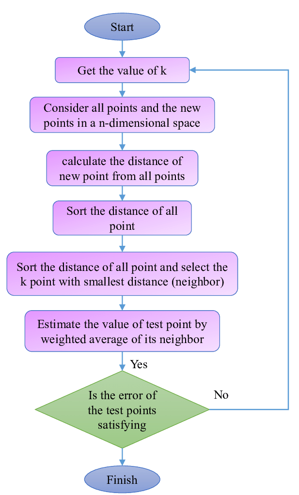

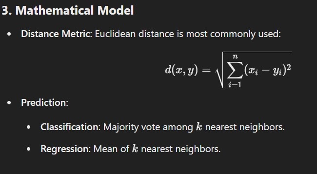

---

### **4. Python Implementation**

#### **Dataset**: Iris Dataset (classification example).  
We use the Iris dataset available from `sklearn.datasets`.

```python
# Import Libraries
import numpy as np
from sklearn.datasets import load_iris
from sklearn.model_selection import train_test_split
from sklearn.preprocessing import StandardScaler
from sklearn.neighbors import KNeighborsClassifier
from sklearn.metrics import accuracy_score, classification_report

# Load Dataset
iris = load_iris()
X, y = iris.data, iris.target

# Split Dataset into Training and Testing
X_train, X_test, y_train, y_test = train_test_split(X, y, test_size=0.3, random_state=42)

# Standardize the Data
scaler = StandardScaler()
X_train = scaler.fit_transform(X_train)
X_test = scaler.transform(X_test)

# KNN Classifier
k = 5  # Number of Neighbors
knn = KNeighborsClassifier(n_neighbors=k)
knn.fit(X_train, y_train)

# Make Predictions
y_pred = knn.predict(X_test)

# Evaluate the Model
accuracy = accuracy_score(y_test, y_pred)
print(f"Accuracy: {accuracy:.2f}")
print("Classification Report:\n", classification_report(y_test, y_pred))
```

---

### **5. Dataset File and Output**
The Iris dataset is part of `sklearn` 
---

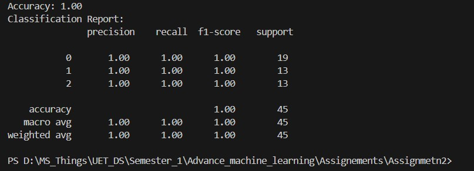


# **Naïve Bayes (NB)**


### **1. Description of Algorithm**
Naïve Bayes is a probabilistic supervised learning algorithm based on Bayes' Theorem.  
- **Assumption**: All features are independent (hence "naïve").  
- **Working Principle**: It calculates the probability of each class given the input features and selects the class with the highest probability.  
- **Applications**: Spam filtering, sentiment analysis, and document classification.  
- **Advantages**: Fast, simple, and effective for large datasets.  
- **Disadvantages**: The independence assumption rarely holds in real-world data.

---

### **2. Flow Diagram**

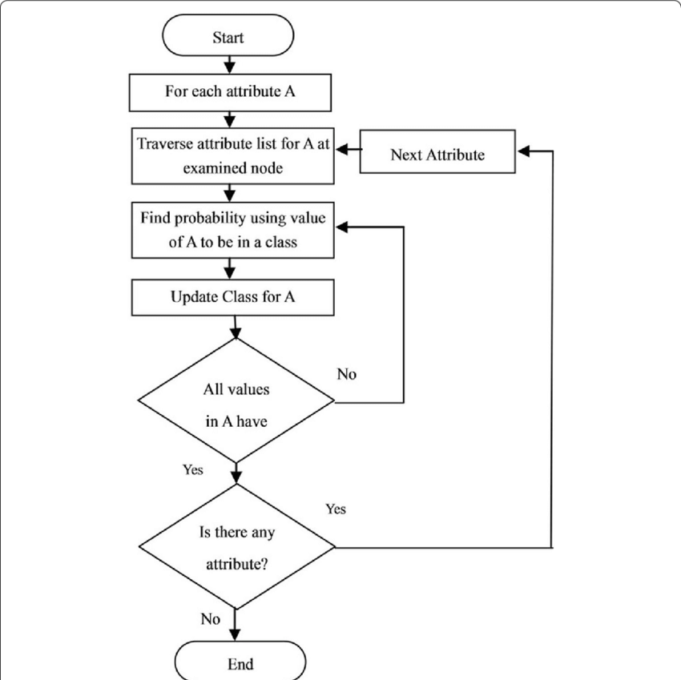
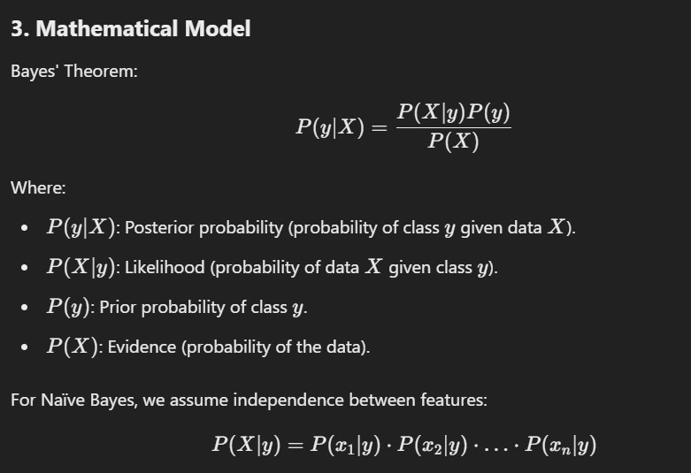


### **4. Python Implementation**

#### **Dataset**: SMS Spam Classification Dataset.  

```python
# Import Libraries
import numpy as np
from sklearn.datasets import fetch_20newsgroups
from sklearn.feature_extraction.text import CountVectorizer
from sklearn.model_selection import train_test_split
from sklearn.naive_bayes import MultinomialNB
from sklearn.metrics import accuracy_score, classification_report

# Load Dataset
categories = ['alt.atheism', 'sci.space']  # Using two categories for simplicity
newsgroups = fetch_20newsgroups(subset='all', categories=categories)
X, y = newsgroups.data, newsgroups.target

# Convert Text to Numerical Data
vectorizer = CountVectorizer(stop_words='english')
X = vectorizer.fit_transform(X)

# Train-Test Split
X_train, X_test, y_train, y_test = train_test_split(X, y, test_size=0.3, random_state=42)

# Train Naïve Bayes Model
nb = MultinomialNB()
nb.fit(X_train, y_train)

# Predictions
y_pred = nb.predict(X_test)

# Evaluation
accuracy = accuracy_score(y_test, y_pred)
print(f"Accuracy: {accuracy:.2f}")
print("Classification Report:\n", classification_report(y_test, y_pred))
```

---


### **5. Dataset File and Output**
The dataset is available in `sklearn.datasets`


---

### **Support Vector Machine (SVM)**

---

### **1. Description of Algorithm**
Support Vector Machine (SVM) is a supervised learning algorithm used for classification and regression.  
- **Working Principle**: It finds the hyperplane that best separates classes with the maximum margin.  
- **Applications**: Image classification, bioinformatics, and text categorization.  
- **Advantages**: Effective for high-dimensional data, works well with a clear margin of separation.  
- **Disadvantages**: Not suitable for large datasets, sensitive to the choice of kernel.

---

### **2. Flow Diagram**

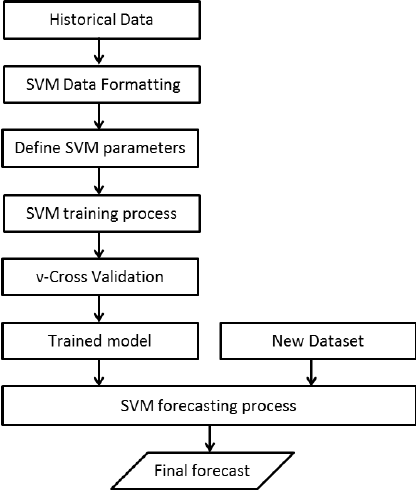
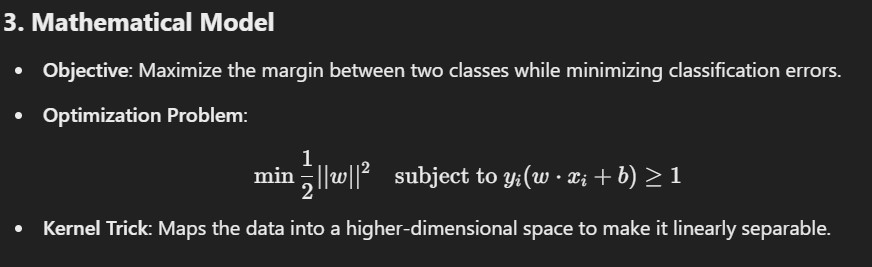

---
### **4. Python Implementation**

#### **Dataset**: Iris Dataset (classification example).

```python
# Import Libraries
from sklearn import datasets
from sklearn.model_selection import train_test_split
from sklearn.preprocessing import StandardScaler
from sklearn.svm import SVC
from sklearn.metrics import accuracy_score, classification_report

# Load Dataset
iris = datasets.load_iris()
X, y = iris.data, iris.target

# Select Only Two Classes for Binary Classification
X = X[y != 2]
y = y[y != 2]

# Train-Test Split
X_train, X_test, y_train, y_test = train_test_split(X, y, test_size=0.3, random_state=42)

# Standardize the Data
scaler = StandardScaler()
X_train = scaler.fit_transform(X_train)
X_test = scaler.transform(X_test)

# Train SVM Model
svm = SVC(kernel='linear', C=1.0, random_state=42)
svm.fit(X_train, y_train)

# Predictions
y_pred = svm.predict(X_test)

# Evaluation
accuracy = accuracy_score(y_test, y_pred)
print(f"Accuracy: {accuracy:.2f}")
print("Classification Report:\n", classification_report(y_test, y_pred))
```

---

### **5. Dataset File and Ouptut**
The **Iris Dataset** is included in `sklearn` and does not require external download.
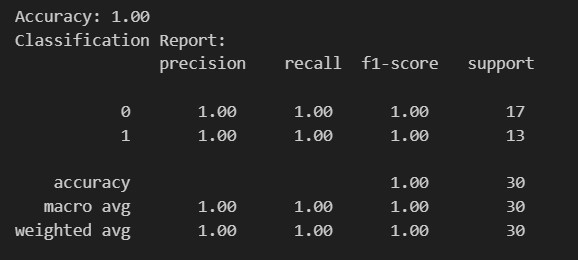
---

# **Artificial Neural Network (ANN)**

---

### **1. Description of Algorithm**
An Artificial Neural Network (ANN) is inspired by the structure and function of the human brain.  
- **Working Principle**: It consists of interconnected layers of neurons that transform input data to output predictions by learning weights through backpropagation.  
- **Applications**: Image recognition, speech processing, natural language processing.  
- **Advantages**: Can model complex patterns and nonlinear relationships.  
- **Disadvantages**: Requires large datasets, computationally expensive, prone to overfitting.

---

### **2. Flow Diagram**


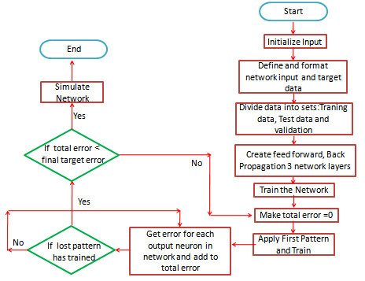
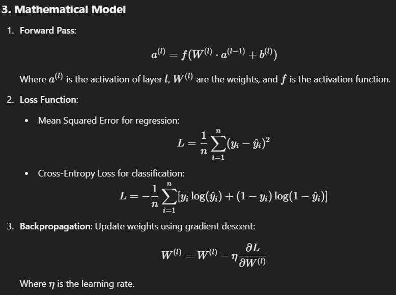


---

### **4. Python Implementation**

#### **Dataset**: MNIST Dataset (Digit Classification).  

```python
# Import Libraries
import tensorflow as tf
from tensorflow.keras.models import Sequential
from tensorflow.keras.layers import Dense, Flatten
from tensorflow.keras.datasets import mnist
from tensorflow.keras.utils import to_categorical

# Load Dataset
(X_train, y_train), (X_test, y_test) = mnist.load_data()

# Preprocess Data
X_train, X_test = X_train / 255.0, X_test / 255.0  # Normalize
y_train, y_test = to_categorical(y_train), to_categorical(y_test)  # One-hot encoding

# Define ANN Model
model = Sequential([
    Flatten(input_shape=(28, 28)),  # Input Layer
    Dense(128, activation='relu'),  # Hidden Layer
    Dense(10, activation='softmax')  # Output Layer
])

# Compile Model
model.compile(optimizer='adam', loss='categorical_crossentropy', metrics=['accuracy'])

# Train Model
model.fit(X_train, y_train, epochs=5, batch_size=32)

# Evaluate Model
loss, accuracy = model.evaluate(X_test, y_test)
print(f"Test Accuracy: {accuracy:.2f}")
```

---

### **5. Dataset File and Output**
The **MNIST dataset** is included in `tensorflow.keras.datasets` and does not require external downloads.
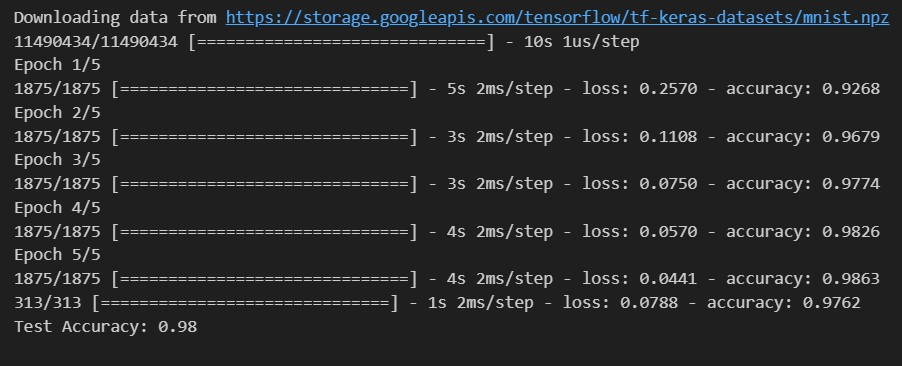
---

# **K-Means Clustering**

---

### **1. Description of Algorithm**
K-Means is an unsupervised clustering algorithm used to group data into \( k \) clusters.  
- **Working Principle**: It minimizes the variance within clusters by iteratively updating cluster centroids.  
- **Applications**: Customer segmentation, image compression, and document clustering.  
- **Advantages**: Simple and scalable.  
- **Disadvantages**: Sensitive to initialization and the value of \( k \), struggles with non-spherical clusters.

---

### **2. Flow Diagram**

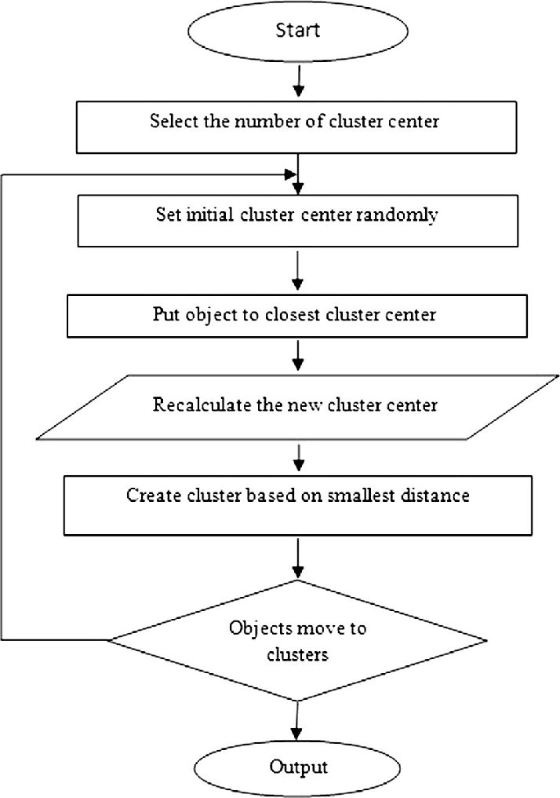
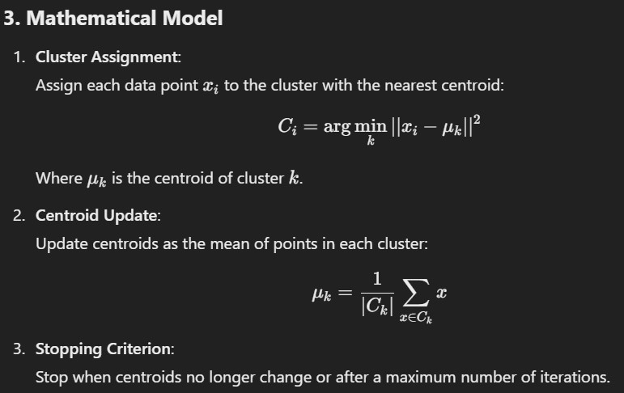
---


3. **Stopping Criterion**:  
   Stop when centroids no longer change or after a maximum number of iterations.

---

### **4. Python Implementation**

#### **Dataset**: Iris Dataset (unsupervised clustering example).  

```python
# Import Libraries
from sklearn.cluster import KMeans
from sklearn import datasets
import matplotlib.pyplot as plt
import seaborn as sns

# Load Dataset
iris = datasets.load_iris()
X = iris.data

# Apply K-Means Clustering
kmeans = KMeans(n_clusters=3, random_state=42)
kmeans.fit(X)
labels = kmeans.labels_

# Visualize Clustering (2D Plot)
plt.figure(figsize=(8, 6))
sns.scatterplot(x=X[:, 0], y=X[:, 1], hue=labels, palette="viridis", s=100)
plt.title("K-Means Clustering on Iris Dataset")
plt.xlabel("Feature 1")
plt.ylabel("Feature 2")
plt.legend(title="Cluster")
plt.show()
```

---

### **5. Dataset File and Output**
The **Iris dataset** is included in `sklearn.datasets` and does not require external downloads.

  

---
# **Hierarchical Clustering**


### **1. Description of Algorithm**
Hierarchical Clustering is an unsupervised learning algorithm that builds a hierarchy of clusters by either:  
1. **Agglomerative (Bottom-Up)**: Each data point starts as its own cluster and merges until one cluster is formed.  
2. **Divisive (Top-Down)**: Starts with one cluster containing all points and splits recursively into smaller clusters.

- **Applications**: Gene sequence analysis, customer segmentation, document clustering.  
- **Advantages**: No need to predefine the number of clusters, provides a dendrogram for better insights.  
- **Disadvantages**: Computationally expensive for large datasets.

---
### **2. Flow Diagram**

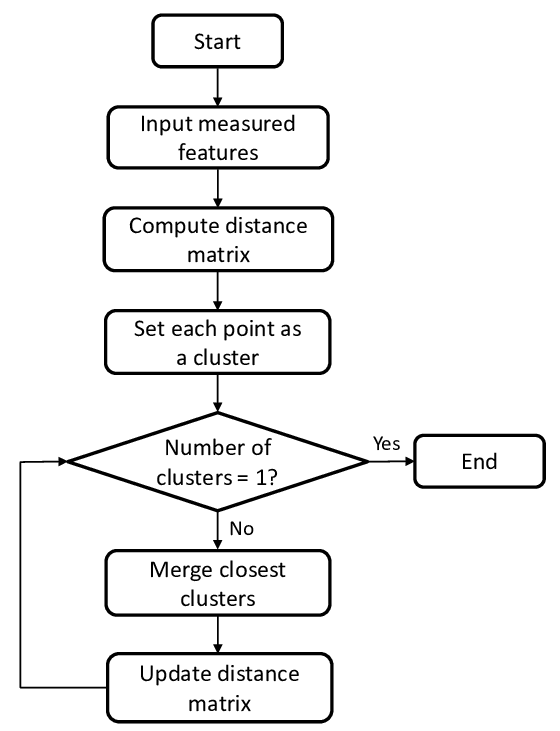
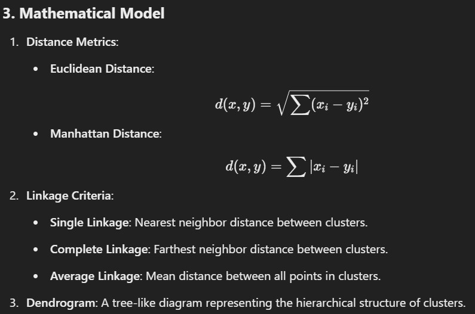


### **4. Python Implementation**

#### **Dataset**: Iris Dataset (unsupervised clustering example).

```python
# Import Libraries
from sklearn.datasets import load_iris
from scipy.cluster.hierarchy import dendrogram, linkage
from scipy.spatial.distance import pdist
import matplotlib.pyplot as plt

# Load Dataset
iris = load_iris()
X = iris.data

# Calculate Linkage Matrix
linkage_matrix = linkage(X, method='ward')  # Ward's method minimizes variance within clusters

# Plot Dendrogram
plt.figure(figsize=(10, 6))
dendrogram(linkage_matrix, truncate_mode='level', p=3, labels=iris.target)
plt.title("Hierarchical Clustering Dendrogram")
plt.xlabel("Data Points")
plt.ylabel("Distance")
plt.show()
```
---

### **5. Dataset File and Output**
The **Iris dataset** is included in `sklearn.datasets` and does not require external downloads.

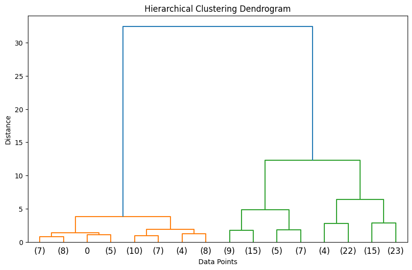

---


# **Principal Component Analysis (PCA)**


### **1. Description of Algorithm**
Principal Component Analysis (PCA) is a dimensionality reduction technique used to transform high-dimensional data into a lower-dimensional space while preserving as much variance as possible.  
- **Working Principle**: It identifies directions (principal components) in which the data varies the most and projects data onto these axes.  
- **Applications**: Data visualization, noise reduction, feature extraction.  
- **Advantages**: Simplifies data without much information loss.  
- **Disadvantages**: Sensitive to scaling, assumes linearity.

---

### **2. Flow Diagram**

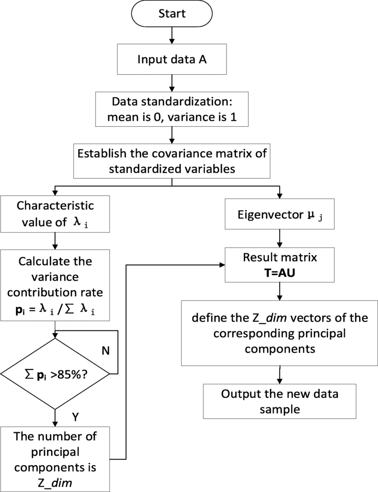

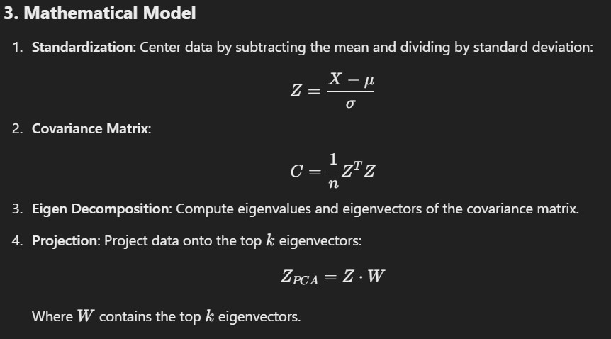

---


### **4. Python Implementation**

#### **Dataset**: Iris Dataset (dimensionality reduction example).

```python
# Import Libraries
from sklearn.decomposition import PCA
from sklearn.datasets import load_iris
import matplotlib.pyplot as plt
import seaborn as sns

# Load Dataset
iris = load_iris()
X, y = iris.data, iris.target

# Apply PCA
pca = PCA(n_components=2)  # Reduce to 2 dimensions for visualization
X_pca = pca.fit_transform(X)

# Plot PCA Results
plt.figure(figsize=(8, 6))
sns.scatterplot(x=X_pca[:, 0], y=X_pca[:, 1], hue=y, palette='viridis', s=100)
plt.title("PCA on Iris Dataset")
plt.xlabel("Principal Component 1")
plt.ylabel("Principal Component 2")
plt.legend(title="Class")
plt.show()
```

---

### **5. Dataset File and Output**
The **Iris dataset** is included in `sklearn.datasets` and does not require external downloads.
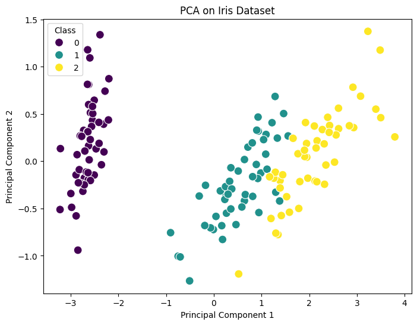

# **Reinforcement Learning (Q-Learning)**

---

### **1. Description of Algorithm**
Q-Learning is a model-free reinforcement learning algorithm used to learn an optimal policy for an agent interacting with an environment by using rewards.  
- **Working Principle**: It uses a Q-table to store the expected utility of taking a given action in a given state.  
- **Applications**: Game playing, robotics, autonomous systems.  
- **Advantages**: Does not require a model of the environment, works for discrete spaces.  
- **Disadvantages**: Inefficient for large state spaces, requires tuning of hyperparameters.

---

### **2. Flow Diagram**

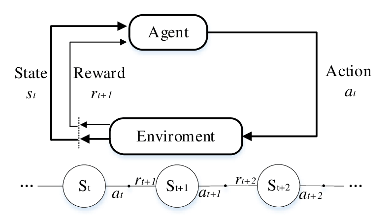

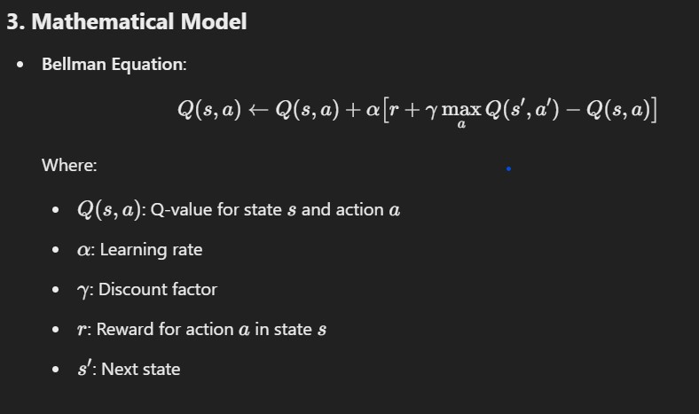
---
### **4. Python Implementation**

#### **Environment**: FrozenLake (OpenAI Gym).  

```python
import numpy as np
import random

# Define the environment
grid_size = 4
goal_state = (3, 3)
obstacles = [(1, 1), (2, 2)]
actions = ['up', 'down', 'left', 'right']

# Helper functions
def is_valid_state(state):
    return (
        0 <= state[0] < grid_size and 
        0 <= state[1] < grid_size and 
        state not in obstacles
    )

def get_next_state(state, action):
    if action == 'up':
        next_state = (state[0] - 1, state[1])
    elif action == 'down':
        next_state = (state[0] + 1, state[1])
    elif action == 'left':
        next_state = (state[0], state[1] - 1)
    elif action == 'right':
        next_state = (state[0], state[1] + 1)
    else:
        next_state = state

    return next_state if is_valid_state(next_state) else state

def get_reward(state):
    return 10 if state == goal_state else -1

# Initialize Q-Table
q_table = {}
for i in range(grid_size):
    for j in range(grid_size):
        q_table[(i, j)] = {a: 0 for a in actions}

# Training parameters
episodes = 500
learning_rate = 0.1
discount_factor = 0.9
epsilon = 0.1

# Q-Learning algorithm
for episode in range(episodes):
    state = (0, 0)  # Start state
    done = False

    while not done:
        # Choose action: ε-Greedy
        if random.uniform(0, 1) < epsilon:
            action = random.choice(actions)
        else:
            action = max(q_table[state], key=q_table[state].get)

        # Take action
        next_state = get_next_state(state, action)
        reward = get_reward(next_state)

        # Update Q-value
        q_table[state][action] += learning_rate * (
            reward + discount_factor * max(q_table[next_state].values()) - q_table[state][action]
        )

        # Move to next state
        state = next_state

        # Check if goal is reached
        if state == goal_state:
            done = True

print("Q-Table after training:")
for state, actions in q_table.items():
    print(state, actions)

# Test the policy
print("\nTesting Optimal Policy:")
state = (0, 0)
path = [state]

while state != goal_state:
    action = max(q_table[state], key=q_table[state].get)
    state = get_next_state(state, action)
    path.append(state)

print("Optimal Path:", path)

```

---

### **5. Dataset and Output**
This is custom dataset

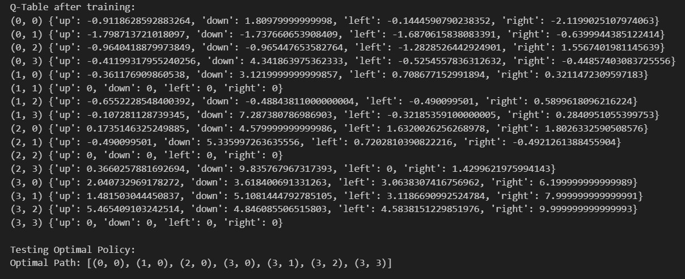

